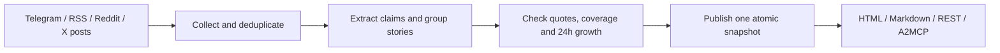

# AstraFeed

[](https://github.com/kryptogrib/astrafeed-agent/actions/workflows/check.yml)

**What changed across crypto sources, who said it first, and where is the evidence?**

AstraFeed turns posts from 38 curated public Telegram channels, RSS and Reddit feeds, and selected X accounts into a live agenda for humans and AI agents. It groups posts into stories, compares the last 24 hours with the previous 24, and links every displayed claim to its original source. The same published snapshot is available as a readable page, JSON, Markdown, and an OKX.AI A2MCP service.

**[Open the live agenda](https://cutememe.lol/agenda?format=html)** · **[Watch the 2:56 demo](docs/submission/astrafeed-demo.mp4)** · [Check the live service](https://cutememe.lol/healthz)

Built for **OKX Dev Day 2026 · Build a Company / OKX AI**. A2MCP endpoint: `POST https://cutememe.lol/a2mcp/astrafeed`. OKX.AI agent **[#13877](https://www.okx.ai/agents/13877)** is publicly listed with the free **AstraFeed Crypto Agenda** service.

| Link | Notes |
|---|---|
| [Live agenda](https://cutememe.lol/agenda?format=html) | Public HTTPS |
| [A2MCP](https://cutememe.lol/a2mcp/astrafeed) | Empty `POST` returns the agenda; open the URL in a browser for the curl |
| [OKX.AI #13877](https://www.okx.ai/agents/13877) | Public marketplace listing; free AstraFeed Crypto Agenda service |
| [Demo video](docs/submission/astrafeed-demo.mp4) | 2:56 narrated product and A2MCP walkthrough |

The marketplace listing points to the same public HTTPS A2MCP endpoint.

## Start here

The live service and these six files are the product. The earlier Token Brief engine is documented in [PROVENANCE.md](PROVENANCE.md); frozen research runs are under `artifacts/`.

1. [docs/product.md](docs/product.md) — what the product promises
2. [src/astrafeed/domain/agenda.py](src/astrafeed/domain/agenda.py) — quote spans, windows, growth rules
3. [src/astrafeed/application/agenda_signals.py](src/astrafeed/application/agenda_signals.py) — echoes, conflicting figures, price before/after Telegram
4. [src/astrafeed/application/agenda_changes.py](src/astrafeed/application/agenda_changes.py) — `since_snapshot_id` report delta
5. [src/astrafeed/application/agenda_query.py](src/astrafeed/application/agenda_query.py) — JSON / Markdown / HTML from the published snapshot
6. [src/astrafeed/adapters/http/a2mcp.py](src/astrafeed/adapters/http/a2mcp.py) — OKX.AI tool over the same read API

`make check` runs ruff, mypy, import-linter, and pytest.

### Invariants the code enforces

| Guarantee | Where it is checked |
|---|---|
| `quote == text[start:end]`, or the unique occurrence | `tests/domain/test_agenda.py::test_quote_accepted_only_when_span_matches_or_unique_occurrence` |
| paraphrase numbers exist in attached quotes | `tests/domain/test_agenda.py::test_paraphrase_cannot_invent_numbers_absent_from_quotes` |
| a failed or incomplete channel is not treated as zero | `tests/domain/test_agenda.py::test_comparable_channels_require_complete_processing_of_both_windows` |
| growth is `null` when the comparable set is too small | `tests/domain/test_agenda.py::test_growth_is_null_when_comparable_set_is_too_small` |
| off-topic digest claims do not enter the crypto top 10 | `tests/domain/test_agenda.py::test_crypto_agenda_skips_story_without_market_anchor_in_displayed_evidence` |
| reanalysis preserves previously pinned snapshots | `tests/application/test_agenda_cycle.py::test_cycle_publishes_snapshot_and_restart_does_not_duplicate` |
| HTTP adapters do not import the cycle or LLM | `tests/adapters/http/test_http_isolation.py::test_http_adapters_do_not_import_llm_or_the_cycle` |
| domain does not import adapters or application | `.importlinter` contract `domain`, run by `make check` |

### Measured quality

Manual source review in [artifacts/agenda-eval/quality-2026-09-25.md](artifacts/agenda-eval/quality-2026-09-25.md), not a CI score:

- **29/29** displayed quotes in the pinned public baseline cards were verbatim in the linked Telegram posts
- **38/38** counted publication quotes on live `snap-20260924T215317Z` were verbatim
- that live cycle ran **91 seconds** from collect to full success
- code invariants reproduce with `make check`

## The detail that matters: an evidence trail

“Six channels reported this” sounds persuasive, but one may have copied another. AstraFeed shows **the order of posts, near-verbatim echoes, sourcing labels, conflicting quoted figures, and links**. A channel count describes reach; it does not prove six independent confirmations.

Here is a real, pinned [HYPE listing story](https://cutememe.lol/stories/st-e5cf2256e3f917de?format=html&snapshot_id=snap-20260924T221840Z) from the **24 Sep 2026, 22:18 UTC** snapshot:

| Observed in our channels | Source |
|---|---|
| 07:30 UTC · first observed post | [@cryptoattack24](https://t.me/cryptoattack24/96920) |
| +2 min · another post | [@Defiscamcheck](https://t.me/Defiscamcheck/4879) |
| +179 min · near-verbatim echo of @Defiscamcheck | [@WEB3_AGGREGATOR](https://t.me/WEB3_AGGREGATOR/423706) |

The card records **6 channels, including 1 detected echo**, and shows the [exact quoted announcement](https://t.me/marketfeed/1044681). “First” means first among channels AstraFeed observed, based on post time. An echo is a text-similarity finding, not proof of coordination. The story also carries an OKX spot price change since the first post; that is market context, **not a claim that the post moved the price**. The example is a historical snapshot, so its figures do not silently change with the live feed.

The same trail flags disagreements when quoted amounts differ. It keeps the original wording and source links so a reader can decide what to trust. AstraFeed reports what channels **said**, not whether the underlying event is true.

When a close later retelling drops an explicit uncertainty word such as “potentially,” the card shows **both exact phrases and links** under “Qualifier dropped in later wording.” This describes a change in wording; it does not claim the event was confirmed or that one channel copied another.

## See it in 60 seconds

1. Open the [live agenda](https://cutememe.lol/agenda?format=html). Each card shows its sources, growth, and any available evidence signals.
2. Open a card, follow a Telegram link, and check the quote against the post.
3. For a stable example, open the [pinned HYPE card](https://cutememe.lol/stories/st-e5cf2256e3f917de?format=html&snapshot_id=snap-20260924T221840Z).

For an agent, an **empty POST returns the agenda**:

```sh
curl -sS -X POST https://cutememe.lol/a2mcp/astrafeed \
  -H 'content-type: application/json' -d '{}'
```

Search, then open a card using the `story_id` and `snapshot_id` in the response:

```sh
curl -sS -X POST https://cutememe.lol/a2mcp/astrafeed \
  -H 'content-type: application/json' -d '{"query":"HYPE"}'

curl -sS -X POST https://cutememe.lol/a2mcp/astrafeed \
  -H 'content-type: application/json' \
  -d '{"story_id":"st-e5cf2256e3f917de","snapshot_id":"snap-20260924T221840Z"}'
```

The response has `service`, `action` (`agenda`, `search`, or `story`), and `result`. Use `"format":"md"` for a short Markdown brief. The REST views are `GET /agenda`, `GET /stories/search?q=HYPE`, and `GET /stories/{id}`; the agenda and story card also accept `?format=html` or `?format=md`. `GET /healthz` exposes the running commit, cycle state, and latest snapshot. Before the first snapshot, agenda calls return `503 {"status":"preparing"}`.

## What the numbers mean

| Field | Meaning |
|---|---|
| `current_channels` | Observed Telegram channels, RSS publishers, subreddits, or X accounts/search sources with a story publication in the latest 24-hour window. The field name is retained for API compatibility. |
| `growth` | Change against the preceding 24 hours on channels complete and processed in **both** windows. It can be lower than `current_channels` when one source is still incomplete. Uncomparable data gets `null`, never a fabricated zero. |
| `independent_channels` / `echo_channels` | A text-similarity split of observed posts. “Independent” means *no near-verbatim copy detected*, not independent verification. |
| `first_seen` | Publication time of the first post assigned to the story in observed channels. The displayed spread timeline starts with the first linked source in the current window and can begin later. |
| `confirmation` | A label inferred from wording and attribution in posts; inspect the linked source before relying on it. |
| `signals.caveat_drop` | An optional pair of closely matched source sentences where explicit uncertainty disappears in the later wording, with both links and publication gap. |
| `coverage`, `stale`, `limitations` | What was collected and processed, and what the snapshot cannot support. |
| `price.verdict` | Code label from OKX spot: did the market move in the hour **before** the first observed post, after it, both, or neither. Context, not causation. |

The watched sources are a curated sample, not a representative sample of the whole market. A top agenda card needs an explicit crypto or market anchor in its displayed title or source quotes; other extracted stories remain searchable. Quotes in the English report may be machine-translated; JSON retains the original. Search also covers archive stories in their source language; displayed agenda titles are English. Reader comments are unverified and shown as takeaways only when the quoted comment explicitly names a story entity. A comment link opens its parent post or thread when Telegram has no direct comment URL. Silence does not mean agreement. No sentiment score or trading recommendation is produced.

## Poll for changes

An agent saves the returned `snapshot_id`, then requests
`GET /agenda?since_snapshot_id=snap-...` or posts
`{"since_snapshot_id":"snap-..."}` to `/a2mcp/astrafeed`.
The delta contains new/updated cards and changes in sources, quotes and sourcing
labels. An unavailable baseline returns the full agenda with
`baseline_unavailable`. `snapshot_id` can still pin the target of the comparison.
Each published ID identifies one immutable report, including when analysis is
repeated without a new collection. The public host supports this on deployed
commits; check `GET /healthz` →
`commit` when comparing an older pinned snapshot with a newer live one.
[Response fields, examples and limits](docs/snapshot-changes.md).

## How it works

### Source coverage

Add HTTPS feed URLs under `rss_feeds` in `config.yaml` (the sample config lists
CoinDesk, The Block, Cointelegraph, Decrypt, Bitcoin Magazine, CryptoSlate,
The Defiant, Blockworks, Bloomberg Crypto, Crypto Briefing, Protos and FT Crypto).
The polling cycle reads them alongside Telegram channels. Articles enter the
same story extraction and search flow, with the publisher's original link in
each card. Run `uv run astrafeed-pulse backfill-posts --window 2d` to load the
currently available feed entries before the next cycle. RSS feeds often expose
only recent entries; the response keeps incomplete history visible in coverage
and does not count it as zero activity. Publisher rate limits or feed errors
affect that feed only. This configuration changes future local snapshots;
historical snapshots and the hosted demo above are unchanged.

Set `reddit_feeds` to individual subreddit RSS URLs to include Reddit posts.
The sample configuration includes 20 crypto communities, including
`r/CryptoCurrency`, `r/Bitcoin`, `r/ethereum`, `r/solana`, and `r/defi`. They
are fetched as one combined newest-post feed to respect Reddit's RSS request
limit, while each post retains its own subreddit and permalink. Reddit RSS
does not supply thread comments; the combined feed exposes at most 100 recent
posts, so a busy interval may have incomplete coverage. The configured
`https://protos.com/feed` remains in the news RSS list.

Selected X accounts and a broad crypto search are collected through Xpoz when
`XPOZ_API_KEY` and `xpoz_accounts` are configured. The sample configuration lists
16 accounts; search runs every 15 minutes and the account scan every 12 hours.
Up to three new reply threads are inspected per hour, within a 70-thread cap.
The collector stops paid Xpoz requests when the account falls below 50 credits.
X coverage is a sampled view of what Xpoz returns; missed posts or replies are
shown as incomplete coverage rather than counted as silence. See the
[source setup and limits](docs/research/xpoz-integration.md).



Collection and analysis run in the background. Read requests use the published snapshot and do not call the LLM. A `snapshot_id` pins follow-up searches and cards to one consistent view. Extraction uses OpenRouter under a daily spend cap; source and snapshot data live in SQLite. See the [live smoke record](artifacts/agenda-eval/live-smoke.md) and [manual quality audit](artifacts/agenda-eval/quality-2026-09-25.md) for concrete checks and known errors.

## Run locally

Requires Docker, a Telegram reader account, and an OpenRouter API key. An Xpoz
key is optional for local X collection.

```sh
cp .env.example .env            # set TELEGRAM_API_ID/HASH and OPENROUTER_API_KEY
cp config.example.yaml config.yaml
make install && make login      # create the Telegram reader session
docker compose up -d --build    # API at http://localhost:8000
curl http://localhost:8000/healthz
```

The first analysis can take time; `/healthz` shows progress and `/agenda` becomes available after a snapshot is published. `make check` runs lint, types, import-linter, and tests. For a public HTTPS deployment, see `docker-compose.tunnel.yml` and set `CLOUDFLARE_TUNNEL_TOKEN` in `.env`.

## Hackathon scope

The earlier [AstraFeed Token Brief](PROVENANCE.md) supplied the Telegram ingestion, filtering, and deduplication engine. This hackathon added live story extraction and assignment, comparable growth, quote and coverage checks, immutable snapshots, the read API, the evidence signals, and the A2MCP endpoint. Changes since the starting commit are visible with `git log aa9a275..HEAD`.

The OKX.AI service is free; a paid x402 tier is a future plan, not part of the live demo. The [product brief](docs/product.md) defines the current scope; the [MVP plan](docs/plans/community-pulse-mvp.md) records the contracts and earlier experiments.
