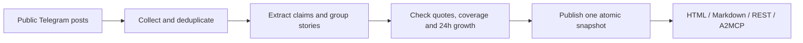

# AstraFeed

**What changed in crypto Telegram, who said it first, and where is the evidence?**

AstraFeed turns posts from 38 selected public channels into a live agenda for humans and AI agents. It groups posts into stories, compares the last 24 hours with the previous 24, and links every displayed claim to its original Telegram post. The same published snapshot is available as a readable page, JSON, Markdown, and an OKX.AI A2MCP service.

**[Open the live agenda](https://cutememe.lol/agenda?format=html)** · **[Check the live service](https://cutememe.lol/healthz)** · [Source code](https://github.com/kryptogrib/astrafeed-agent)

Built for **OKX Dev Day 2026 · Build a Company / OKX AI**. A2MCP endpoint: `POST https://cutememe.lol/a2mcp/astrafeed`.

## The detail that matters: an evidence trail

“Six channels reported this” sounds persuasive, but one may have copied another. AstraFeed shows **the order of posts, near-verbatim echoes, sourcing labels, conflicting quoted figures, and links**. A channel count describes reach; it does not prove six independent confirmations.

Here is a real, pinned [HYPE listing story](https://cutememe.lol/stories/st-e5cf2256e3f917de?format=html&snapshot_id=snap-20260924T221840Z) from the **24 Sep 2026, 22:18 UTC** snapshot:

| Observed in our channels | Source |
|---|---|
| 07:30 UTC · first observed post | [@cryptoattack24](https://t.me/cryptoattack24/96920) |
| +2 min · another post | [@Defiscamcheck](https://t.me/Defiscamcheck/4879) |
| +179 min · near-verbatim echo of @Defiscamcheck | [@WEB3_AGGREGATOR](https://t.me/WEB3_AGGREGATOR/423706) |

The card records **6 channels, including 1 detected echo**, and shows the [exact quoted announcement](https://t.me/marketfeed/1044681). “First” means first among channels AstraFeed observed, based on post time. An echo is a text-similarity finding, not proof of coordination. The story also carries an OKX spot price change since the first post; that is market context, **not a claim that the post moved the price**. The example is a historical snapshot, so its figures do not silently change with the live feed.

The same trail flags disagreements when quoted amounts differ. It keeps the original wording and source links so a reader can decide what to trust. AstraFeed reports what channels **said**, not whether the underlying event is true.

## See it in 60 seconds

1. Open the [live agenda](https://cutememe.lol/agenda?format=html). Each card shows its sources, growth, and any available evidence signals.
2. Open a card, follow a Telegram link, and check the quote against the post.
3. For a stable example, open the [pinned HYPE card](https://cutememe.lol/stories/st-e5cf2256e3f917de?format=html&snapshot_id=snap-20260924T221840Z).

For an agent, an **empty POST returns the agenda**:

```sh
curl -sS -X POST https://cutememe.lol/a2mcp/astrafeed \
  -H 'content-type: application/json' -d '{}'
```

Search, then open a card using the `story_id` and `snapshot_id` in the response:

```sh
curl -sS -X POST https://cutememe.lol/a2mcp/astrafeed \
  -H 'content-type: application/json' -d '{"query":"HYPE"}'

curl -sS -X POST https://cutememe.lol/a2mcp/astrafeed \
  -H 'content-type: application/json' \
  -d '{"story_id":"st-e5cf2256e3f917de","snapshot_id":"snap-20260924T221840Z"}'
```

The response has `service`, `action` (`agenda`, `search`, or `story`), and `result`. Use `"format":"md"` for a short Markdown brief. The REST views are `GET /agenda`, `GET /stories/search?q=HYPE`, and `GET /stories/{id}`; the agenda and story card also accept `?format=html` or `?format=md`. `GET /healthz` exposes the running commit, cycle state, and latest snapshot. Before the first snapshot, agenda calls return `503 {"status":"preparing"}`.

## What the numbers mean

| Field | Meaning |
|---|---|
| `current_channels` | Observed channels with a story post in the latest 24-hour window. |
| `growth` | Change against the preceding 24 hours on channels complete and processed in **both** windows. Uncomparable data gets `null`, never a fabricated zero. |
| `independent_channels` / `echo_channels` | A text-similarity split of observed posts. “Independent” means *no near-verbatim copy detected*, not independent verification. |
| `first_seen` | First matching post time in the observed channels, not the first report anywhere. |
| `confirmation` | A label inferred from wording and attribution in posts; inspect the linked source before relying on it. |
| `coverage`, `stale`, `limitations` | What was collected and processed, and what the snapshot cannot support. |

The watched channels are a curated Russian-language Telegram folder, not a representative sample of the whole market. Quotes in the English report may be machine-translated; JSON retains the original. Reader comments, when shown, are marked unverified. No sentiment score or trading recommendation is produced.

## Poll for changes

An agent saves the returned `snapshot_id`, then requests
`GET /agenda?since_snapshot_id=snap-...` or posts
`{"since_snapshot_id":"snap-..."}` to `/a2mcp/astrafeed`.
The delta contains new/updated cards and changes in sources, quotes and sourcing
labels. An unavailable baseline returns the full agenda with
`baseline_unavailable`. `snapshot_id` can still pin the target of the comparison.
[Response fields, examples and limits](docs/snapshot-changes.md).

## How it works



Collection and analysis run in the background. Read requests use the published snapshot and do not call the LLM. A `snapshot_id` pins follow-up searches and cards to one consistent view. Extraction uses OpenRouter under a daily spend cap; source and snapshot data live in SQLite. See the [live smoke record](artifacts/agenda-eval/live-smoke.md) and [manual quality audit](artifacts/agenda-eval/quality-2026-09-25.md) for concrete checks and known errors.

## Run locally

Requires Docker, a Telegram reader account, and an OpenRouter API key.

```sh
cp .env.example .env            # set TELEGRAM_API_ID/HASH and OPENROUTER_API_KEY
cp config.example.yaml config.yaml
make install && make login      # create the Telegram reader session
docker compose up -d --build    # API at http://localhost:8000
curl http://localhost:8000/healthz
```

The first analysis can take time; `/healthz` shows progress and `/agenda` becomes available after a snapshot is published. `make check` runs lint, types, and tests. For a public HTTPS deployment, see `docker-compose.tunnel.yml` and set `CLOUDFLARE_TUNNEL_TOKEN` in `.env`.

## Hackathon scope

The earlier [AstraFeed Token Brief](PROVENANCE.md) supplied the Telegram ingestion, filtering, and deduplication engine. This hackathon added live story extraction and assignment, comparable growth, quote and coverage checks, immutable snapshots, the read API, the evidence signals, and the A2MCP endpoint. Changes since the starting commit are visible with `git log aa9a275..HEAD`.

The OKX.AI service is intended to be free during review; a paid x402 tier is a future plan, not part of the live demo. The [product brief](docs/product.md) defines the current scope; the [MVP plan](docs/plans/community-pulse-mvp.md) records the contracts and earlier experiments.
